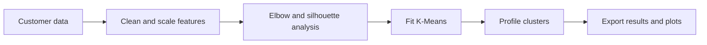

# Customer Segmentation with K-Means

An unsupervised machine learning project that groups customers by behavioral and demographic similarity to support targeted marketing and customer analysis.

## Overview

The notebook prepares customer data, scales numerical features, searches for a useful number of clusters, fits K-Means, and explains the resulting segments through visualizations and exported summaries.

It can run with a custom `data/customers.csv` file or generate a reproducible sample dataset when no input file is available.

## Analysis Pipeline



## Features

- standardization with `StandardScaler`
- elbow-curve and silhouette-score comparison
- PCA-based two-dimensional visualization
- cluster-level profile and center analysis
- CSV export of labeled customers and cluster centers

## Data

The included sample data uses five features: age, annual income, spending score, purchase frequency, and average order value.

To use another dataset, save it as `data/customers.csv` and keep the expected numerical columns consistent with the notebook.

## Outputs

- `output/clustered_customers.csv`
- `output/cluster_centers.csv`
- `output/last_figure.png`
- cluster-distribution and PCA visualizations

## Tech Stack

- Python
- Pandas and NumPy
- scikit-learn
- Matplotlib and Seaborn
- JupyterLab

## Project Structure

```text
.
|-- customer_segmentation.ipynb
|-- data/
|   `-- sample_customers.csv
|-- output/
|   |-- clustered_customers.csv
|   |-- cluster_centers.csv
|   `-- last_figure.png
|-- requirements.txt
`-- README.md
```

## Installation and Usage

```bash
git clone https://github.com/guru8880/customer-segmentation-using-k-means.git
cd customer-segmentation-using-k-means
python -m venv venv
```

```bash
# Windows
venv\Scripts\activate

# macOS/Linux
source venv/bin/activate
```

```bash
pip install -r requirements.txt
jupyter lab
```

Open `customer_segmentation.ipynb` and run all cells in order.

## Limitations

- K-Means assumes roughly compact, similarly scaled clusters.
- Segment meaning depends on the business relevance of the input features.
- Synthetic sample results are demonstrations, not real customer insights.

## Future Improvements

- add categorical-feature support
- compare K-Means with hierarchical clustering and DBSCAN
- generate automatic business-friendly names for each segment
- expose the workflow through an interactive dashboard
